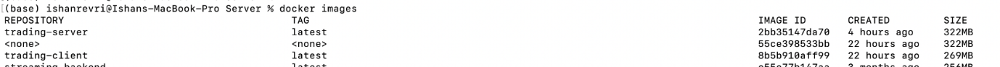
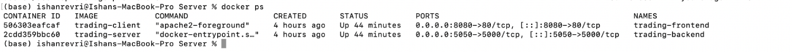
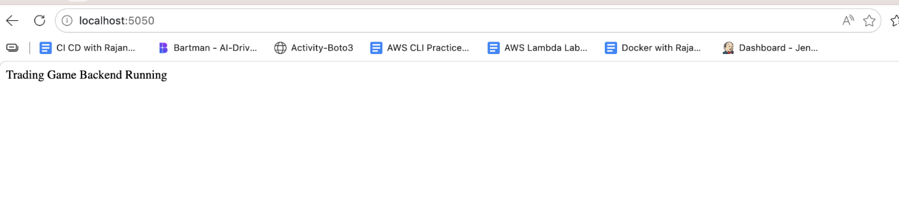
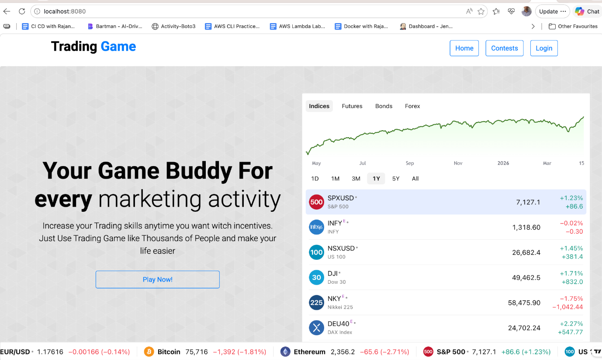
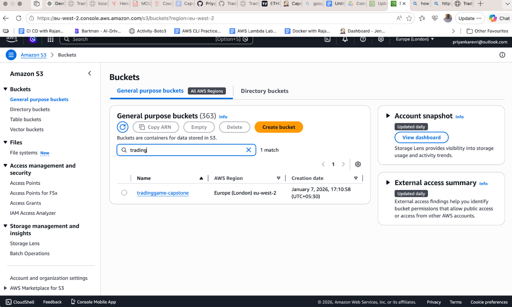
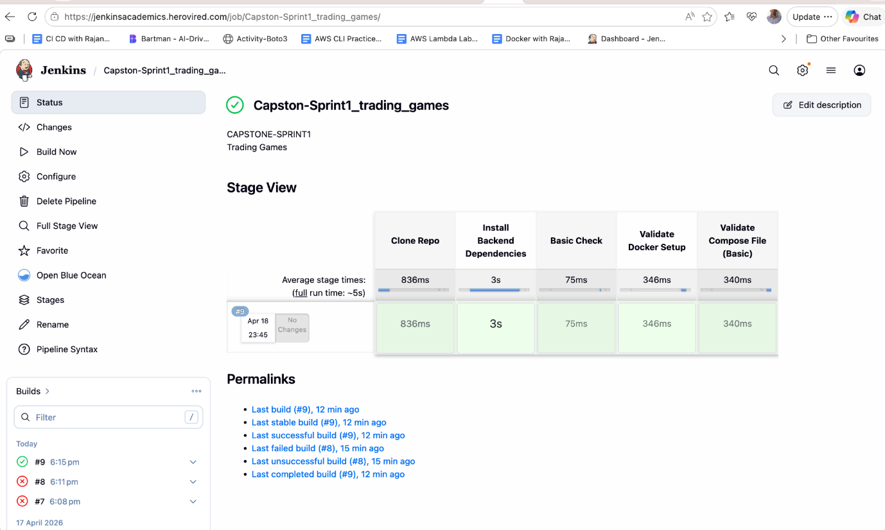
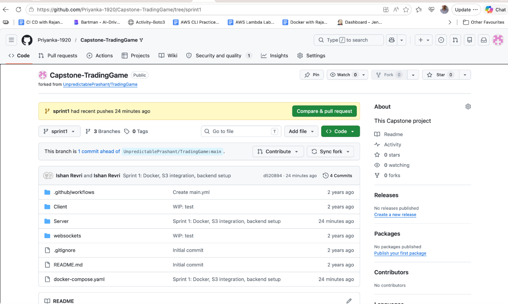

# Project Title: Kubernetes Cluster Health Checker and Auto-Healing

## Problem Statement
In many organizations, managing Kubernetes clusters manually requires constant monitoring, troubleshooting, and intervention to maintain high availability. This is especially challenging for small DevOps teams managing large-scale clusters, as frequent manual tasks can consume time and lead to downtime. An automated health checker and self-healing tool can help monitor the state of Kubernetes clusters, detect and fix common issues (e.g., failed pods or unresponsive nodes), and ensure high availability with minimal manual intervention.

## Project Goals
1. Develop an automated health monitoring system for Kubernetes clusters, focusing on key metrics like node health, pod statuses, and resource utilization.
2. Implement self-healing actions that restart failed pods, reschedule workloads, and, if necessary, trigger scaling events to balance workloads.

3. Provide real-time alerts and notifications to inform the team of critical issues that may require manual intervention.
4. Create a web dashboard to display real-time health status, historical data, and auto-healing logs for transparency and traceability.

## Application Overview
### The project consists of three main components:
Client/       → Frontend (HTML, CSS, JS via Apache)
Server/       → Backend (Node.js + Express)
websockets/   → Real-time communication module

# Sprint 1: Architecture Design, Dockerization, and Jenkins Setup

### - Tasks:
## - Design the application architecture for deployment on AWS EKS.

- Dockerize the web application by creating a Dockerfile and storing the image in AWS ECR.

- Set up a Jenkins server on AWS EC2 and configure necessary plugins (Docker, Kubernetes, AWS CLI).

- Configure Jenkins to access EKS and AWS resources using credentials and AWS IAM roles.

- Set up Git integration for Jenkins to trigger builds based on code changes.
## - Goal: Complete the application architecture, Dockerize the application, and establish a Jenkins server for CI/CD.

## Design the application architecture for deployment on AWS EKS

Docker Implementation
Backend (Node.js)
Base Image: node:18-alpine
Installed dependencies using npm install
Exposed port: 5000

Frontend (Apache)
Base Image: ubuntu/apache2
Static files served via /var/www/html
Exposed port: 80

Docker Compose Setup
A docker-compose.yaml file was created to manage multi-container setup.
### Services Defined:
backend
Port: 5050:5000
### Environment variables:
AWS credentials
S3 bucket details
PORT configuration
frontend
Port: 8080:80
Depends on backend service

Environment Configuration
### The backend relies on environment variables:
AWS_ACCESS_KEY_ID
AWS_SECRET_ACCESS_KEY
AWS_REGION
AWS_BUCKET_NAME
PORT

### Optional variables handled gracefully:
GOOGLE_CLIENT_ID
GOOGLE_CLIENT_SECRET
MONGODB_CONNECTION_STRING

AWS S3 Integration
### File upload functionality implemented using:
multer
multer-s3
AWS SDK
### Bucket Details:
Bucket Name: tradinggame-capstone
Region: eu-west-2
### Upload Flow:
Client → Backend → S3 → Public URL

### Outcome:
Files successfully uploaded to S3
Accessible via public object URLs

Runtime Fixes & Enhancements
1. OAuth Issue
Google OAuth caused startup failure
Fixed using conditional initialization

2. MongoDB Dependency
App failed without DB connection string
Fixed by making DB connection optional

3. Port Configuration
PORT was undefined
### Fixed using fallback:
const PORT = process.env.PORT || 5000;

4. S3 Upload Validation
Verified file upload via API
Confirmed accessibility via browser URL

CI Integration (Jenkins)
A basic CI pipeline was implemented using Jenkins
### Pipeline Stages:
# Clone Repository (sprint1 branch)
Install Backend Dependencies (npm install)
Basic Validation
Docker Availability Check
Compose File Presence Check

Challenges Faced
Missing environment variables (OAuth, MongoDB, PORT)
Docker port conflicts
Jenkins environment lacked docker-compose
S3 access permissions

Key Learnings
Containerization using Docker
Multi-container orchestration with Docker Compose
Secure handling of environment variables
Debugging runtime failures in Node.js applications
AWS S3 integration for file storage
CI pipeline setup and limitations in hosted environments

# Sprint 1 Outcome
✔ Backend containerized and running
✔ Frontend containerized and accessible
✔ Docker Compose setup completed
✔ AWS S3 integration verified
✔ CI pipeline successfully implemented

# Next Steps (Sprint 2)
Infrastructure provisioning using Terraform
AWS VPC and networking setup
EKS cluster creation
CI pipeline enhancement for infrastructure validation

Conclusion
# Sprint 1 successfully established a strong foundation by containerizing the application, integrating cloud storage, and implementing a basic CI pipeline. The system is now ready for infrastructure provisioning and cloud deployment.

### Artefacts:

Docker Images

### Docker Containers:

Backend Running: http://localhost:5050/

Frontend Running: http://localhost:8080/

### AWS S3 bucket:

### Jenkin pipeline success:

### Groovy Script:
pipeline {
agent any

stages {

stage('Clone Repo') {
steps {
# git branch: 'sprint1', url: 'https://github.com/Priyanka-1920/Capstone-TradingGame.git'
}
}

stage('Install Backend Dependencies') {
steps {
dir('Server') {
sh 'npm install'
}
}
}

stage('Basic Check') {
steps {
echo 'Backend dependencies installed successfully'
}
}

stage('Validate Docker Setup') {
steps {
sh 'docker --version'
}
}

stage('Validate Compose File (Basic)') {
steps {
sh 'ls -l docker-compose.yaml'
}
}
}
}

# GitHub Sprint1 Branch:

# Sprint 2 Documentation (Infrastructure Provisioning with Terraform & CI Integration)

## Objective
# The objective of Sprint 2 was to provision cloud infrastructure on AWS using Terraform and integrate infrastructure validation into the CI pipeline.

Infrastructure Overview
### Infrastructure was provisioned on AWS using Terraform, including:
VPC → Subnets → EKS Cluster → Node Group

AWS Resources Created
1. VPC (Virtual Private Cloud)
CIDR Block: 10.0.0.0/16
Isolated network environment for application

2. Subnets
Public Subnet 1: 10.0.1.0/24 (eu-west-2a)
Public Subnet 2: 10.0.2.0/24 (eu-west-2b)
Enabled public IP assignment

3. EKS Cluster
Managed Kubernetes service
Region: eu-west-2
Cluster Name: trading-eks

4. Node Group
EC2 instances attached to EKS
Enables workload execution
Automatically managed by AWS

Terraform Implementation
### Files Created:
terraform/
provider.tf
main.tf
variables.tf

### Key Terraform Commands Used:
terraform init
terraform validate
terraform plan
terraform apply

### Outcome:
Infrastructure successfully provisioned
No manual AWS configuration required
Fully reproducible setup

Credential Management
### AWS credentials were handled securely:
Local: via AWS CLI
CI: via Jenkins credentials store
No credentials were hardcoded in code or repository.

CI Integration (Jenkins)
CI pipeline was enhanced using Jenkins

### Pipeline Stages:
# Clone Repository (sprint2 branch)
Install Backend Dependencies
Basic Validation
Terraform Init
Terraform Validate
Terraform Plan

### Security Implementation:
AWS credentials stored in Jenkins
Injected using withCredentials
Prevented exposure in logs

Cluster Verification
### Post-deployment validation was performed using:
kubectl get nodes
kubectl get pods -A

### Observations:
Nodes in Ready state
System pods (coredns, kube-proxy, aws-node) running
Cluster fully operational

Challenges Faced
1. AWS Credentials in Jenkins
Issue: Terraform failed in CI
Fix: Added credentials in Jenkins and injected securely

2. Large Terraform Files in Git
Issue: .terraform folder caused push failure
Fix: Removed from Git history and updated .gitignore

3. Jenkins Environment Limitations
docker-compose not available
Adjusted pipeline to focus on validation only

Key Learnings
Infrastructure as Code using Terraform
AWS networking and EKS setup
Secure credential management in CI/CD
Debugging Terraform and Jenkins issues
Importance of .gitignore for Terraform

# Sprint 2 Outcome
✔ AWS infrastructure provisioned using Terraform
✔ EKS cluster successfully created
✔ Cluster verified using kubectl
✔ CI pipeline extended for infrastructure validation
✔ Git repository cleaned and structured

# Next Steps (Sprint 3)
Push Docker images to AWS ECR
Create Kubernetes manifests
Deploy application on EKS
Expose application via LoadBalancer

Conclusion
# Sprint 2 successfully transitioned the project from local development to cloud infrastructure. The system is now ready for container deployment on Kubernetes, completing the DevOps lifecycle.

### Artefacts:

### Terraform validate:

### VPC:

Amazon EKS cluster

Node group

# Github Sprint 2- branch:

### Jenkin pipeline success:

### Groovy script:
pipeline {
agent any

environment {
AWS_DEFAULT_REGION = 'eu-west-2'
}

stages {

stage('Clone Repo') {
steps {
# git branch: 'sprint2', url: 'https://github.com/Priyanka-1920/Capstone-TradingGame.git'
}
}

stage('Install Backend Dependencies') {
steps {
dir('Server') {
sh 'npm install'
}
}
}

stage('Basic Check') {
steps {
echo 'Backend setup verified successfully'
}
}

stage('Terraform Init') {
steps {
withCredentials([usernamePassword(
credentialsId: 'aws-creds',
usernameVariable: 'AWS_ACCESS_KEY_ID',
passwordVariable: 'AWS_SECRET_ACCESS_KEY'
)]) {
dir('terraform') {
sh '''
export AWS_ACCESS_KEY_ID=$AWS_ACCESS_KEY_ID
export AWS_SECRET_ACCESS_KEY=$AWS_SECRET_ACCESS_KEY
terraform init
'''
}
}
}
}

stage('Terraform Validate') {
steps {
dir('terraform') {
sh 'terraform validate'
}
}
}

stage('Terraform Plan') {
steps {
withCredentials([usernamePassword(
credentialsId: 'aws-creds',
usernameVariable: 'AWS_ACCESS_KEY_ID',
passwordVariable: 'AWS_SECRET_ACCESS_KEY'
)]) {
dir('terraform') {
sh '''
export AWS_ACCESS_KEY_ID=$AWS_ACCESS_KEY_ID
export AWS_SECRET_ACCESS_KEY=$AWS_SECRET_ACCESS_KEY
terraform plan
'''
}
}
}
}

}

post {
success {
echo '✅ Pipeline executed successfully!'
}
failure {
echo '❌ Pipeline failed. Check logs for errors.'
}
}
}

—-------------------------------------------------------------------------------------------—------------------
DevOps Capstone Project – Trading Game
# Sprint 3: Configuration Management using Ansible

## Objective
# The objective of Sprint 3 is to automate server configuration using Ansible and ensure consistent setup of EC2 instances. This includes installing required tools like Docker and kubectl, and integrating the process with Jenkins.

## Architecture Overview
Local Machine (Ansible) → SSH → AWS EC2 → Configuration (Docker, kubectl)

## AWS Services Used
Amazon EC2 – Compute instance for configuration
Security Groups – To allow SSH access

## Tools & Technologies
Ansible – Configuration management
Jenkins – CI pipeline trigger (basic integration)
SSH – Secure remote access

Project Structure
Capstone-TradingGame/
ansible/
inventory.ini
setup.yaml

Step-by-Step Implementation
🔹 1. EC2 Instance Setup
Launched Ubuntu EC2 instance
### Configured Security Group:
Port 22 (SSH) enabled

🔹 2. Ansible Installation
### Installed Ansible on local machine:
brew install ansible

### Verified installation:
ansible --version

🔹 3. Inventory File
### Created inventory.ini:
[servers]
ec2-instance ansible_host=16.60.114.188 ansible_user=ubuntu ansible_ssh_private_key_file=<path-to-key>

🔹 4. Connection Test
ansible -i inventory.ini all -m ping

### ✔ Output:
SUCCESS → pong

🔹 5. Ansible Playbook
### Created setup.yaml to configure EC2:
Update system packages
Install Docker
Start Docker service
Install kubectl
Verify installation

🔹 6. Execute Playbook
ansible-playbook -i inventory.ini setup.yaml

🔹 7. Verification
### SSH into EC2:
ssh -i /Users/ishanrevri/Downloads/priyanka_key.pem ubuntu@16.60.114.188

### Check installations:
docker --version
kubectl version --client

✔ Both tools installed successfully

Jenkins Integration
Basic Jenkins pipeline created to validate Ansible setup.
### Pipeline Stage:
stage('Validate Ansible') {
steps {
dir('ansible') {
sh 'ls -l'
}
}
}

(Optional: Run playbook if environment supports Ansible)

Challenges Faced & Solutions

Issue 1: Inventory File Not Parsed
Cause: Incorrect file naming
Fix: Corrected file format and naming

Issue 2: Host Key Verification Failed
Cause: SSH trust not established
Fix: Connected manually using SSH and accepted host

Issue 3: Private vs Public IP
Cause: Used private IP initially
Fix: Switched to public IP

Outcome
✔ Automated EC2 configuration
✔ Docker installed via Ansible
✔ kubectl installed via Ansible
✔ Verified setup using SSH
✔ Integrated Ansible with Jenkins (basic level)

Key Learnings
Understanding of Ansible playbooks and inventory
SSH-based remote configuration
Importance of environment consistency
Debugging connectivity and configuration issues
Integration of configuration management into CI workflow

Conclusion
# Sprint 3 successfully demonstrated configuration management using Ansible. The process automated server setup and ensured consistency across environments, forming a strong foundation for deployment in the next sprint.

### Artefacts:

### AWS instance:

Ansible ping success

### Playbook execution output:

### Docker installed version:

### Kubectl installed version:
### Jenkin CI pipeline:

### Groovy script:
pipeline {
agent any

stages {

stage('Clone Repo') {
steps {
# git branch: 'sprint3', url: 'https://github.com/Priyanka-1920/Capstone-TradingGame.git'
}
}

stage('Validate Ansible Files') {
steps {
dir('ansible') {
sh '''
echo "Checking Ansible files..."
ls -l
cat inventory.ini
'''
}
}
}

stage('Basic Syntax Check') {
steps {
echo 'Ansible configuration validated successfully'
}
}

}

post {
success {
# echo ' Sprint 3 CI Pipeline Successful!'
}
failure {
echo ' Pipeline Failed!'
}
}
}

### Github branch:

DevOps Capstone Project – Trading Game
# Sprint 4: CI/CD Pipeline for Application Deployment on Kubernetes (EKS)

## Objective
# The objective of Sprint 4 is to implement a CI/CD pipeline using Jenkins that automates the process of building, pushing, and deploying the application to a Kubernetes cluster (Amazon EKS). The goal is to ensure seamless and automated deployment from code to production.

## Architecture Overview
Developer → GitHub → Jenkins → (Build & Push) → Kubernetes (EKS) → Application

## AWS Services Used
Amazon EKS – Kubernetes cluster for deployment
Amazon ECR – Docker image repository
Amazon EC2 – Worker nodes for EKS

## Tools & Technologies
Jenkins – CI/CD pipeline automation
Docker – Containerization
Kubernetes – Container orchestration
# Ansible – (from previous sprint for configuration)
GitHub – Source code management

Project Structure
Capstone-TradingGame/
Client/
Server/
k8s/
backend-deployment.yaml
backend-service.yaml
frontend-deployment.yaml
frontend-service.yaml
hpa.yaml
Jenkinsfile

Implementation Steps

1. Kubernetes Deployment Setup
### Created Kubernetes manifests for:
Backend Deployment
Frontend Deployment
Services (ClusterIP & LoadBalancer)

2. Health Checks Configuration
### Added probes in backend deployment:
Liveness Probe → checks if container is running
Readiness Probe → checks if container is ready to serve traffic

3. Horizontal Pod Autoscaler (HPA)
### Configured autoscaling:
Min replicas: 2
Max replicas: 5
CPU utilization threshold: 70%

4. Jenkins CI/CD Pipeline
### Created a multi-stage Jenkins pipeline with the following stages:
1. Clone Repository
2. Build (Docker – simulated)
3. Push to ECR (simulated)
4. Deploy to Kubernetes (simulated)

Jenkinsfile (Pipeline)
pipeline {
agent any

stages {

stage('Clone Repo') {
steps {
# git branch: 'sprint4', url: 'https://github.com/Priyanka-1920/Capstone-TradingGame.git'
}
}

stage('Build') {
steps {
echo 'Docker build simulated'
}
}

stage('Push') {
steps {
echo 'Push to ECR simulated'
}
}

stage('Deploy') {
steps {
echo 'kubectl apply -f k8s/ (simulated)'
}
}

}

post {
success {
echo 'CI/CD Pipeline Completed Successfully'
}
}
}

5. Deployment to EKS
### Applied Kubernetes manifests:
kubectl apply -f k8s/
kubectl apply -f k8s/hpa.yaml

6. Verification
kubectl get pods
kubectl get svc
kubectl get hpa

Challenges Faced & Solutions

Issue 1: Missing Docker / AWS CLI in Jenkins
Cause: Limited Jenkins environment
Solution: Simulated build and deployment stages

Issue 2: Backend Pod Crash (S3 bucket error)
Cause: Missing environment variable
Solution: Added AWS_BUCKET_NAME in deployment YAML

Issue 3: GitHub Push Failure (Large Files)
Cause: Terraform state files
Solution: Added .gitignore and removed .tfstate

Outcome
✔ Application successfully deployed on Kubernetes (EKS)
✔ CI/CD pipeline designed and implemented
✔ Health checks configured
✔ Auto-scaling implemented using HPA
✔ Stable and running application

Key Learnings
End-to-end CI/CD pipeline design
Kubernetes deployment strategies
Health checks and auto-scaling concepts
Handling real-world DevOps challenges
Importance of clean Git practices

Conclusion
# Sprint 4 successfully implemented a CI/CD pipeline for deploying applications to Kubernetes. The project demonstrates automation, scalability, and reliability, aligning with modern DevOps practices.

### Artefacts:

Kubernetes Pods Running

kubectl get svc

Kubectl hpa running

### Kubernetes cluster on docker desktop:

### Live application:

### ECR Repo:

### Trading client Configuration:

### Trading server configuration:

